 

 

---
## 👨‍💻 About Me

I'm a Full Stack Web Developer focused on building modern, responsive and
scalable web applications.

I enjoy working with **React, Next.js, Node.js and MongoDB**, creating clean
interfaces and connecting them with reliable backend APIs.

> 🚀 Learn → Build → Break → Fix → Repeat
## 🛠️ Tech Stack

### 💻 Frontend

### ⚙️ Backend

### 🗄️ Database & Services

### 🎨 UI & Styling

### 🔧 Tools

---

## 📊 GitHub Stats

---

